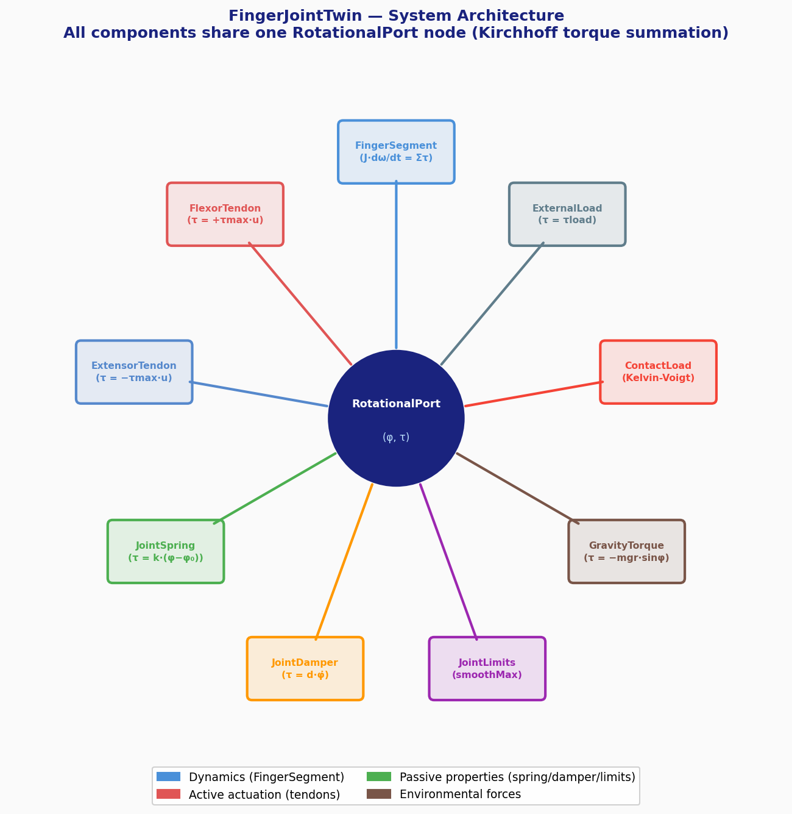
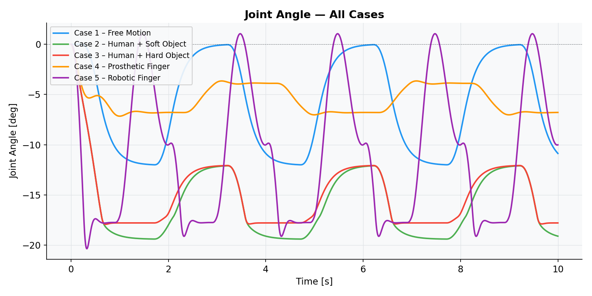
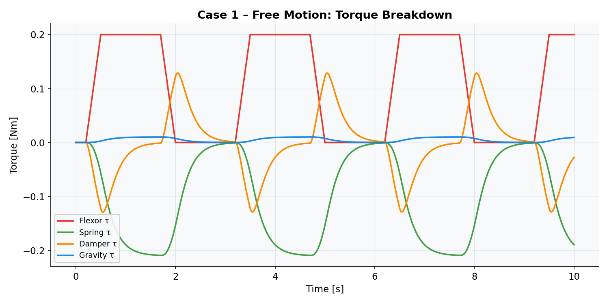
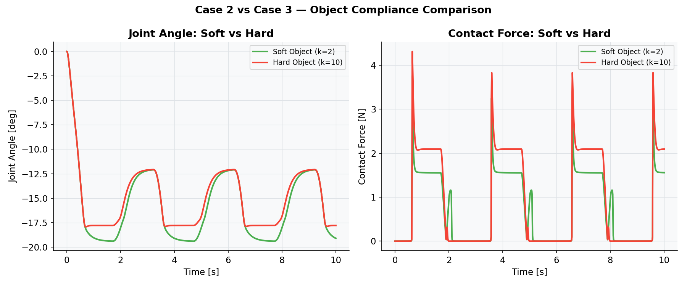
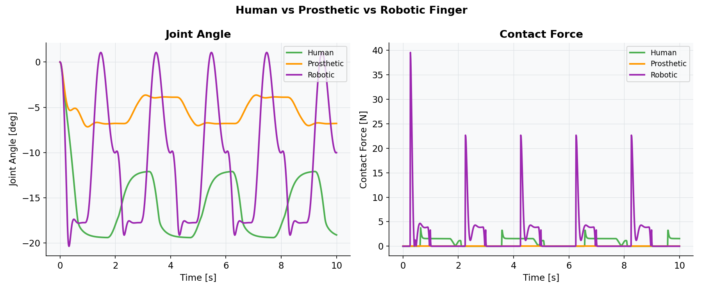
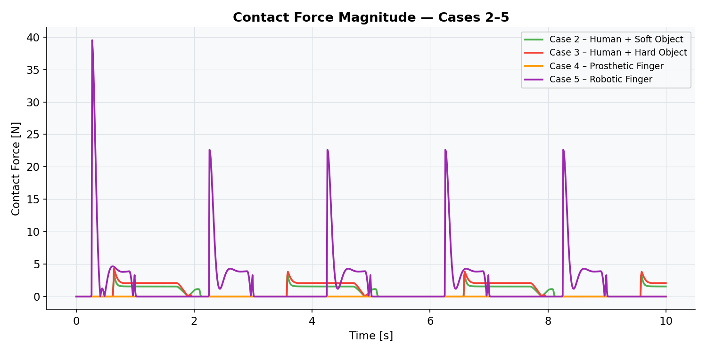

# DigitalFingerJointTwin

[](LICENSE)
[](https://modelica.org)
[](https://openmodelica.org)

A physics-based digital twin of a tendon-driven finger joint, implemented as a reusable Modelica library.

## Motivation

Understanding and replicating the mechanics of a human finger has applications across **prosthetics**, **surgical robotics**, **rehabilitation engineering**, and **industrial grippers**. This project builds a modular digital twin in Modelica that captures the key biomechanical phenomena — tendon actuation, passive tissue stiffness, anatomical limits, gravity, and object contact — all within a single reusable library.

The same model structure, with only parameter changes, represents a human finger, a prosthetic device, and a robotic gripper — demonstrating the power of physics-based digital twins for cross-domain design.

## Library Structure

| Package | Description |
|---|---|
| `Components` | Physical components: segment, tendons, spring, damper, limits, gravity, loads, contact |
| `Interfaces` | `RotationalPort` connector (φ, τ) |
| `Functions` | `smoothMax` — differentiable approximation of max(0, x) for contact and limits |
| `Sources` | Activation signal generators: human (0.5 s ramp), prosthetic (0.3 s ramp), robot (0.1 s ramp), zero |
| `Systems` | `FingerJointSystem` — complete system connecting all components to a shared joint node |
| `Examples` | Six simulation cases (see below) |
| `UsersGuide` | Documentation, references, and contact |

## Physics Model

All components connect to a single shared `RotationalPort` node. The `FingerSegment` integrates the sum of all contributing torques (Kirchhoff torque summation):

| Component | Equation | Units |
|---|---|---|
| Finger Segment | `J · dω/dt = Στ` | J [kg·m²], ω [rad/s] |
| Flexor Tendon | `τ = +τmax · u` | τmax [Nm], u ∈ [0,1] |
| Extensor Tendon | `τ = −τmax · u` | τmax [Nm], u ∈ [0,1] |
| Joint Spring | `τ = k · (φ − φ₀)` | k [Nm/rad], φ₀ [rad] |
| Joint Damper | `τ = d · φ̇` | d [Nms/rad] |
| Gravity Torque | `τ = −m·g·r·sin(φ)` | m [kg], r [m] |
| Joint Limits | `τ = kL · smoothMax(φ − φmax, ε)` | soft anatomical stops |
| Contact Load | `τ = −(k·pen + d·ṗen)` | Kelvin-Voigt spring-damper |
| External Load | `τ = τload` | constant disturbance |

**Sign convention:** positive φ = extension (opening), negative φ = flexion (closing). Contact force at the fingertip: `F_contact = |τ_contact| / L` where L is the lever arm from joint centre to contact point.

## System Architecture

The diagram below shows how all 9 components connect to the central `RotationalPort` node:



## Configuration Parameters

The same `FingerJointSystem` model represents three finger types by changing only these six parameters:

| Parameter | Human (Cases 1–3) | Prosthetic (Case 4) | Robotic (Case 5) | Units |
|---|---|---|---|---|
| Segment inertia J | 0.02 | 0.03 | 0.05 | kg·m² |
| Joint stiffness k | 1.0 | 3.0 | 4.0 | Nm/rad |
| Joint damping d | 0.3 | 0.20 | 0.10 | Nms/rad |
| Flexor τmax | 0.20 | 0.25 | 0.60 | Nm |
| Extensor τmax | 0.20 | 0.25 | 0.60 | Nm |
| Object stiffness kContact | 2 (soft) / 10 (hard) | 10 | 20 | Nm/rad |
| Lever arm L | 0.04 | 0.045 | 0.06 | m |

The prosthetic has higher stiffness and damping (mechanical joint friction). The robotic finger has the highest stiffness (rigid linkage), largest inertia, and 3× the tendon torque capacity, with lower passive damping due to precision bearings.

> **Digital twin note:** All parameters are user-configurable and should be calibrated to your specific subject or device. The values above are representative starting points that produce realistic behavioral dynamics. Replace with measured values (motion capture, system identification, hardware specs) for your application.

## Simulation Cases

| Case | Configuration | What to Observe |
|---|---|---|
| Case 1 | Human — free motion, no contact | Baseline dynamics: flexor drives joint to −0.87 rad (−50°), passive spring/damper damp the transient. No contact torque. |
| Case 2 | Human — soft object (k=2 Nm/rad) | Contact builds gradually; finger slightly overshoots threshold then settles. Low peak grip force (~3–4 N). |
| Case 3 | Human — hard object (k=10 Nm/rad) | Contact triggers earlier and with sharper force rise. Higher peak grip force (~18 N); finger motion arrested rapidly. |
| Case 4 | Prosthetic — hard object | Slower, power-limited actuation (0.6 amplitude, 0.6 s ramp); smoother transient; settles with less oscillation than human. |
| Case 5 | Robotic — very hard object (k=20 Nm/rad) | Fastest response (0.1 s ramp); highest stiffness (k=4.0); sustained grip force; rapid stable settling. |
| Case 6 | Human — bidirectional (flex then extend) | Full open/close cycle: flexor closes the finger, then extensor actively returns it to rest. Demonstrates antagonistic control. |

## Simulation Results

### Joint Angle — All 5 Cases


### Case 1 — Free Motion: Torque Breakdown


### Case 2 vs Case 3 — Soft vs Hard Object


The hard object (k=10 Nm/rad) produces higher contact forces and arrests joint motion earlier than the soft object (k=2 Nm/rad).

### Human vs Prosthetic vs Robotic Finger


The robotic finger reaches contact approximately 5× faster and generates up to 10× higher grip forces than the human configuration.

### Contact Force — Cases 2–5


## How to Run

**Prerequisites:** OpenModelica v1.20+ (OMEdit). Both OpenModelica and the Modelica Standard Library (MSL 4.0) are included in the standard OMEdit installation.

1. Clone or download this repository
2. Open **OpenModelica** (OMEdit)
3. Go to **File → Load Model** and select `FingerJointTwin/package.mo`
4. Navigate to `FingerJointTwin.Examples` in the library browser
5. Start with `Case1_FreeMotion`, simulate for 10 seconds
6. Plot `sys.segment.joint.phi` (joint angle) and `sys.F_contact_abs` (contact force)

## Model Limitations

This is a first-order approximation. The following are intentionally not modelled:

- **Single DOF only** — each instance models one joint; multi-joint coupling (MCP, PIP, DIP) requires separate instances with no kinematic constraints between them
- **Massless, inextensible tendons** — tendon compliance and mass are neglected; force transmission is instantaneous
- **No muscle activation dynamics** — the Hill model (force-velocity, force-length relationships) is not included; activation u maps linearly to torque
- **Linear passive properties** — joint stiffness and damping are constant; real biological tissue is nonlinear and viscoelastic
- **Planar motion only** — out-of-plane (abduction/adduction) DOF are not modelled
- **No skin or fingertip deformation** — contact is modelled as a rigid-body interaction at a fixed threshold angle
- **No experimental validation** — parameter values are based on published ranges; the model has not been fitted to subject-specific measurements
- **Parameters are representative starting points** — as a digital twin, all parameters (J, k, d, tauMax, etc.) are designed to be replaced with measured or identified values for your specific subject, prosthetic device, or robotic system

## References

1. An, K.-N., Ueba, Y., Chao, E. Y., Cooney, W. P., & Linscheid, R. L. (1983). Tendon excursion and moment arm of index finger muscles. *Journal of Biomechanics*, 16(6), 419–425.
2. Hogan, N. (1985). Impedance control: An approach to manipulation. *ASME Journal of Dynamic Systems, Measurement, and Control*, 107(1), 1–24.
3. Deshpande, A. D., et al. (2013). Mechanisms of the anatomically correct testbed hand. *IEEE/ASME Transactions on Mechatronics*, 18(1), 238–250.
4. Zajac, F. E. (1989). Muscle and tendon: Properties, models, scaling, and application to biomechanics and motor control. *Critical Reviews in Biomedical Engineering*, 17(4), 359–411.

## Citation

If you use this library in your research, please cite as:

```bibtex
@software{DigitalFingerJointTwin,
  author  = {Cyrus, Cris and Sunilkumar, Athul and {Sucil Dhas}, Bergin},
  title   = {DigitalFingerJointTwin},
  year    = {2026},
  url     = {https://github.com/criscyrus/DigitalFingerJointTwin},
  version = {1.0.0},
  license = {MIT}
}
```

See also [CITATION.cff](CITATION.cff) and [Poster (PDF)](DigitalFingerJointTwin_Poster.pdf).

## Authors

- **Cris Cyrus** ([@criscyrus](https://github.com/criscyrus)) — Karlsruhe Institute of Technology (KIT)
- **Athul Sunilkumar** — Karlsruhe Institute of Technology (KIT)
- **Bergin Sucil Dhas** — Karlsruhe Institute of Technology (KIT)

*Digital Twin Engineering course, WS 2025/26*
